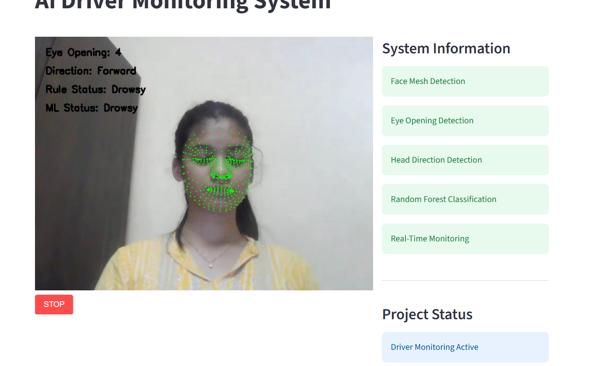

# AI Driver Monitoring System

## Overview

The AI Driver Monitoring System is a real-time computer vision and machine learning project designed to monitor driver alertness and detect unsafe driving behavior.

The system uses facial landmark detection, eye-opening measurements, head direction analysis, and a Random Forest machine learning model to classify the driver's state as:

- Alert
- Drowsy
- Distracted

---

## Features

- Real-time webcam monitoring
- Face Mesh Detection using MediaPipe/CVZone
- Eye Opening Detection
- Head Direction Detection
- Machine Learning Classification
- Streamlit Web Dashboard
- Real-Time Driver Status Monitoring

---

## Technologies Used

- Python
- OpenCV
- Streamlit
- Streamlit-WebRTC
- CVZone
- MediaPipe
- Pandas
- Scikit-Learn
- Joblib

---

## Project Workflow

Webcam Input

↓

Face Mesh Detection

↓

Feature Extraction

(Eye Opening, Head Direction)

↓

Random Forest Model

↓

Driver Classification

(Alert / Drowsy / Distracted)

---

## Files

- live_app.py → Streamlit Dashboard
- generate_dataset.py → Dataset Generation
- train_model.py → Model Training
- driver_dataset.csv → Training Dataset
- driver_model.pkl → Trained Model

---

## Future Improvements

- Yawn Detection
- Mobile Deployment
- Driver Alert Sound System
- Driver Analytics Dashboard

---

## Author

Srushti Korate

B.Tech Artificial Intelligence and Data Science

## Project Screenshots

### Alert State
.png)

### Drowsy State

### Distracted - Looking Right
.png)

### Distracted - Looking Left
.png)
